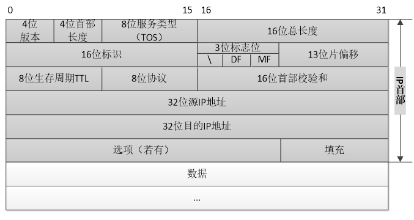
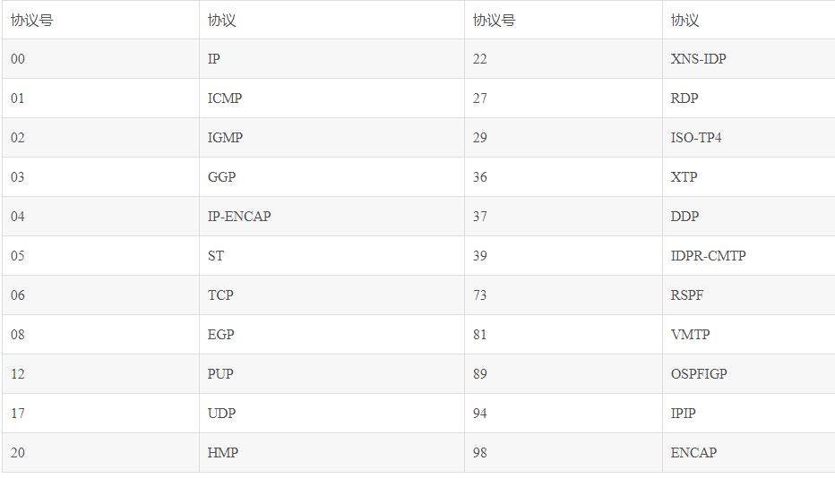
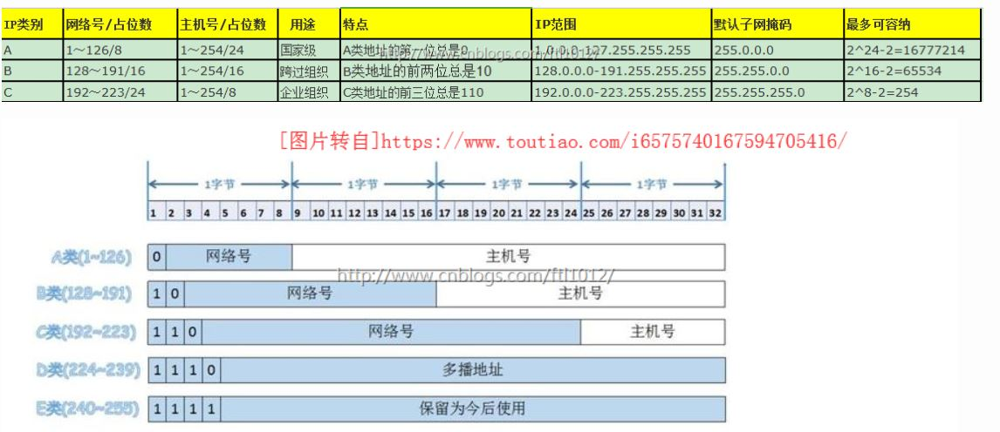
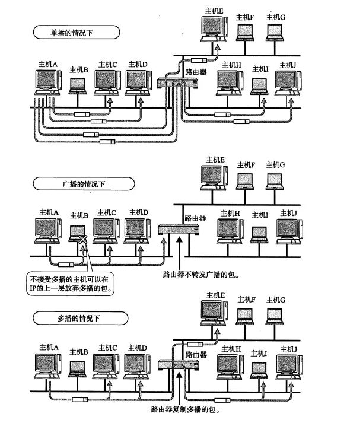
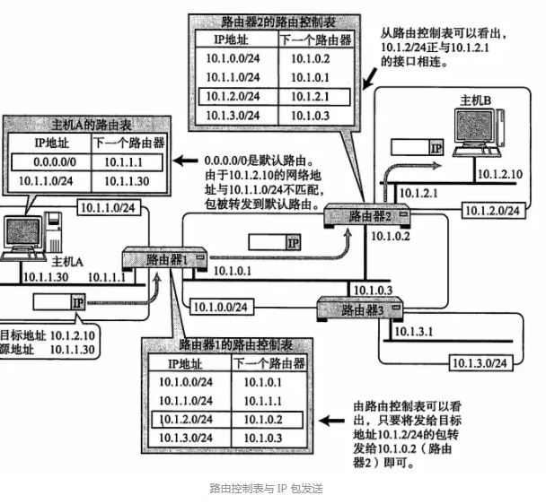
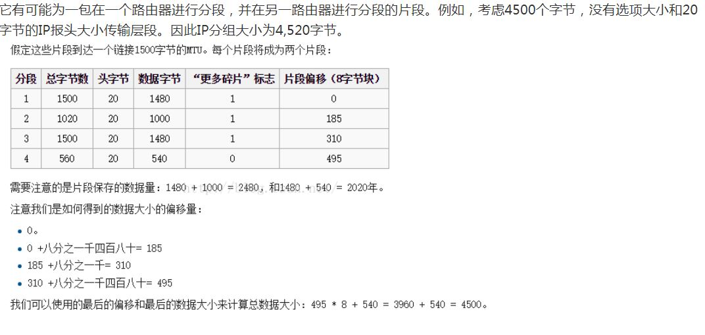

### 一、IP协议的简介

1、ip是tcp协议族中最位核心的协议，很多重要的协议，例如tcp、udp、icmp和igmp都是以ip数据报格式进行传输。

2、ip提供**不可靠的无连接**的**数据报**传输。

3、不可靠传输的意思就是ip不能保证数据报能成功地到达目的地。**如果发生了某种错误导致中间某些数据片丢失。ip会直接把该数据报丢弃，然后发送ICMP消息报给信源端**。任何对可靠性有要求都在上一层去做。

4、无连接简单的意思就是发送方和接收方发送数据之前并不建立连接。同时ip并不维护后续数据报的状态信息，**每个数据报的处理都是独立的、不按照顺序进行发送**。**不同的数据报可以根据当前的网络情况选择不同的路由，有可能先发送的反而慢一点到达**。

### 二、IP协议说明

**1、ip的首部说明**

（1）版本号

​	指定IP协议的版本号｡因为目前仍主要使用IPv4版本,所以这里的值通常是 0x4 (注意封包使用的数字通常都是十六进位的)｡占4位｡

（2）首部长度

​	指明IPv4协议包头长度的字节数包含多少个32位（包含可选项），IPv4包头的最小长度是20个字节,因此IHL这个字段的最小值用十进制表示就是5｡占4位｡由于它是一个4比特字段,因此首部最长为60个字节,但实际上目前最多仍为24个字节｡

（3）8位服务类型（TOS）

​	TOS包括共8位，包括3 bit的优先权字段（取值可以从000-111所有值），4 bit的TOS子字段和1 bit未用位但必须置0。

| 优先权（3bit） | 定义                             | 使用情况                           |
| -------------- | -------------------------------- | ---------------------------------- |
| 111            | Network Control（网络控制）      | 一般保留给网络控制数据使用，如路由 |
| 110            | Internetwork Control（网间控制） | 一般保留给网络控制数据使用，如路由 |
| 101            | Critic（关键）                   | 推荐给语音数据使用                 |
| 100            | Flash Override（疾速）           | 视频会议和视频流使用               |
| 011            | Flash（闪速）                    | 语音控制数据使用                   |
| 010            | Immediate（快速）                | 数据业务使用                       |
| 001            | Priority（优先）                 | 数据业务使用                       |
| 000            | Routine（普通）                  | 默认值                             |

​	4 bit的TOS分别代表：最小时延、最大吞吐量、最高可靠性和最小费用。4 bit中只能置其中1 bit。如果所有4 bit均为0，那么就意味着是一般服务。

（4）包长度（16位）

​	该字段长16比特,单位为byte。所以IP数据报最长可达65535字节｡尽管可以传送一个长达65535字节的IP数据报,但是大多数的链路层都会对它进行分片。（关于ip分片，后面会详细进行叙述）

（5）16位标识（跟ip分片相关）

​	每一个IP封包都有一个16位的唯一识别码｡当程序产生的数据要通过网络传送时都会被拆散成封包形式发送,当封包要进行重组的时候这个ID就是依据了｡占16位｡

​	标识字段唯一地标识主机发送的每一份数据报｡通常每发送一份消息它的值就会加1

（6）3位标志（flags）	跟ip分片相关

​	DF（don‘t fragment）：不分段｡	当此值为0的时候表示封包可以被分段,如果为1则不能被分割｡ 

​	MF（more fragment）：后面还有更多分段。	,此值为0就示该封包是最後一个封包,如果为1则表示其後还有被分割的封包｡

（7）13位分片偏移	跟ip分片相关	8个字节为单位

​	当ip数据报过大的时候，发送过去会拆分为不同的小的数据报，分片偏移就是用来记录这些ip分片在整个ip分片的位置的。接收方进行重组的时候，对于每个数据报，根据分片偏移进行重组。只有当所有的分片都接收完毕的时候，才会把完整的数据报发给传输层。

（8）生存时间(Time To Live,TTL)

​	TTL的初始值由源主机设置(通常为32或64),一旦经过一个处理它的路由器,它的值就减去1｡当该字段的值为0时,数据报就被丢弃,并发送ICMP消息通知源主机｡这样当封包在传递过程中由於某些原因而未能抵达目的地的时候就可以避免其一直充斥在网路上面｡占8位｡

（9）8位协议

​	指该封包所使用的网络协议类型,如ICMP､DNS等｡占8位｡各协议对应的值如下表所示｡

（10）头校验和(Header checksum)

	指IPv4数据报包头的校验和｡这个数值用来检错用的,用以确保封包被正确无误的接收到｡当封包开始进行传送后,接收端主机会利用这个检验值会来检验余下的封包,如果一切无误就会发出确认信息表示接收正常｡与UDP和TCP协议包头中的校验和作用是一样的｡占16位｡
（11）选项(Options)+填充(Padding)

这两个选项较少使用,只有某些特殊的封包需要特定的控制才会利用到｡共32位｡这些选项通常包括:

◆安全和处理限制:用于军事领域

◆记录路径:让每个路由器都记下它的IP地址

◆时间戳:让每个路由器都记下它的IP地址和时间

◆宽松的源站选路:为数据报指定一系列必须经过的IP地址

◆严格的源站选路:与宽松的源站选路类似,但是要求只能经过指定的这些地址,不能经过其他的地址｡

**2、ip地址**

​	**IP 地址分为四个级别，分别为A类、B类、C类、D类。它根据 IP 地址中从第 1 位到第 4 位的比特列对其网络标识和主机标识进行区分。**

​	**A 类 IP 地址是首位以 “0” 开头的地址。**从第 1 位到第 8 位是它的网络标识。用十进制表示的话，0.0.0.0~127.0.0.0 是 A 类的网络地址。A 类地址的后 24 位相当于主机标识。因此，一个网段内可容纳的主机地址上限为16,777,214个。

​	**B 类 IP 地址是前两位 “10” 的地址。**从第 1 位到第 16 位是它的网络标识。用十进制表示的话，128.0.0.0~191.255.0.0 是 B 类的网络地址。B 类地址的后 16 位相当于主机标识。因此，一个网段内可容纳的主机地址上限为65,534个。

​	**C 类 IP 地址是前三位为 “110” 的地址。**从第 1 位到第 24 位是它的网络标识。用十进制表示的话，192.0.0.0~223.255.255.0 是 C 类的网络地址。C 类地址的后 8 位相当于主机标识。因此，一个网段内可容纳的主机地址上限为254个。

​	**D 类 IP 地址是前四位为 “1110” 的地址。**从第 1 位到第 32 位是它的网络标识。用十进制表示的话，224.0.0.0~239.255.255.255 是 D 类的网络地址。D 类地址没有主机标识，常用于多播。

**注意：**

（1）主机号为0表示该网络；主机号全为1表示广播地址。

（2）IP地址分为五类，A类保留给政府机构，B类分配给中等规模的公司，C类分配给任何需要的人，D类用于组播，E类用于实验，另外还有无类地址（以后备用）各类可容纳的地址数目不同。每类地址的详细信息可参阅其他资料。A、B、C类为常用地址。另外，下一代互联网协议（IP v6）将扩展到128位（16个字节）。支持更多级别的地址层次、更多的可寻址节点数以及更简单的地址自动配置。
（3）IP地址还包括公有地址和私有地址。公有地址（Public address）由Inter NIC（Internet Network Information Center 因特网信息中心）负责。这些IP地址分配给注册并向Inter NIC提出申请的组织机构。通过它直接访问因特网。私有地址（Private address）属于非注册地址，专门为组织机构内部使用。以下为留用的私有地址：
       A类 10.0.0.0--10.255.255.255
       B类 172.16.0.0--172.31.255.255
       C类 192.168.0.0--192.168.255.255
（4）我们平时说的局域网地址一般都是在留用的私有地址的范围内，这些地址为非注册IP。公有地址需要注册，也就是我们平时说的固定IP，注册了一个固定IP，别人就可以通过该IP访问你了。局域网和外网交互是通过互联网运营商分配给我们的动态IP（该IP为公有IP地址）。一般是一个局域网分配一个公有IP，局域网内的所有主机通过路由器（或其他设备）——一种映射机制访问外网。

​	在分配 IP 地址时关于主机标识有一点需要注意。即要用比特位表示主机地址时，**不可以全部为 0 或全部为 1**。因为全部为 0 只有在表示对应的网络地址或 IP 地址不可以获知的情况下才使用。而全部为 1 的主机通常作为广播地址。因此，在分配过程中，应该去掉这两种情况。这也是为什么 C 类地址每个网段最多只能有 254（ 28 - 2 = 254）个主机地址的原因。

**3、广播地址**

​	广播地址用于在同一个链路中相互连接的所有主机之间发送数据包。将 IP 地址中的主机地址部分全部设置为 1，就成了广播地址。

​	广播分为**本地广播和直接广播**两种。在本网络内的广播叫做本地广播；在不同网络之间的广播叫做直接广播。

**4、IP多播（组播）**

​	**多播用于将包发送给特定组内的所有主机**。由于其直接使用 IP 地址，因此也不存在可靠传输。

​	相比于广播，**多播既可以穿透路由器**，又可以实现只给那些必要的组发送数据包。请看下图：

​	多播使用 D 类地址。因此，如果从首位开始到第 4 位是 “1110”，就可以认为是多播地址。**而剩下的 28 位可以成为多播的组编号**。

​	此外， 对于多播，所有的主机（路由器以外的主机和终端主机）必须属于 224.0.0.1 的组，所有的路由器必须属于 224.0.0.2 的组。

**5、子网掩码**

​	将原来 A 类、B 类、C 类等分类中的主机地址部分用作子网地址，可以将原网络分为多个物理网络的一种机制。

​	子网掩码用二进制方式表示的话，也是一个 32 位的数字。它对应 IP 地址网络标识部分的位全部为 “1”，对应 IP 地址主机标识的部分则全部为 “0”。由此，一个 IP 地址可以不再受限于自己的类别，而是可以用这样的子网掩码自由地定位自己的网络标识长度。当然，子网掩码必须是 IP 地址的首位开始连续的 “1”。

​	子网掩码有两种表示方法：

（1）ip地址与子网掩码分开写，例如

ip地址：192.168.1.25

子网掩码：255.255.255.0

（2）在每个 IP 地址后面追加网络地址的位数用 “/ ” 隔开，如下：

ip+子网掩码：172.20.0.0/26 

**6、子网掩码深入分析？**

（1）互联网是由很多小型网络组成的，每个网络里面有很多不同的主机。每个小型网络我们用网络号来进行唯一区分，每个主机我们用主机号来唯一区分。

（2）子网掩码就是用来区分网络号和主机号的，子网掩码号翻译成二进制之后，所有为1的位置都是网络号，其余就是主机号。

（3）子网掩码本质就是对原先的每个小网络在进行划分成不同的子网。

**7、IP 地址与路由控制**

（1）IP 地址的网络地址部分用于进行路由控制。

（2）路由控制表中记录着网络地址与下一步应该发送至路由器的地址。

（3）在发送 IP 包时，首先要确定 IP 包首部中的目标地址，再从路由控制表中找到与该地址具有相同网络地址的记录，根据该记录将 IP 包转发给相应的下一个路由器。如果路由控制表中存在多条相同网络地址的记录，就选择一个最为吻合的网络地址。

### 三、IP分片

（1）为什么要进行ip分片？

​	互联网协议使网络互相通信。设计要迎合不同物理性质的网络; 它是独立于链路层使用的基础传输技术。具有不同硬件的网络通常会发生变化，不仅在传输速度，而且在最大传输单元（MTU）。当一个网络要的数据报发送到具有较小MTU的一个网络，它就可能被分为不同的ip分片进行数据传输。

（2）ip分片

​	当路由器收到一个ip数据报的时候，它会检查目的ip，然后根据路由表找到传输的出接口。如果当前的ip数据报大小大于出接口的MTU（最大传输单元），同时ip数据报的首部DF = 0，那么它就会进行分片；如果DF=1，并且大于MTU，那么它直接丢弃，并且发送ICMP告诉源主机这个路由器的MTU的大小是多少。

（3）ip重组

​	接收端如果收到DF=0，MF=1的ip数据报，那么它就知道完整的ip数据报已经被分片了，它需要对ip数据报进行重组。

​	接收端根据16位的标识号标识所收到的ip分片是否属于同一个数据报。

​	然后根据片内偏移把所有的分片进行重组。

​	当收到最后一个分片的时候，把最后一个分片重组成功，才把完整的数据内容转发给上一层（传输层）